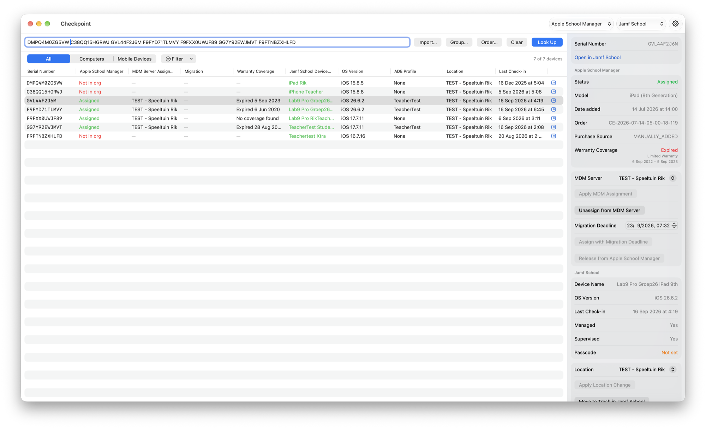

  

# Checkpoint

*One list of serial numbers. Both sides of the story.*

## What it does

Checkpoint is a macOS app for Mac admins that cross-references devices between **Apple Business** or **Apple School Manager** and **Jamf Pro** or **Jamf School**. Instead of switching between two consoles to establish where a device actually stands, you get both perspectives side by side in one table, and the tools to act on what you find.

Enter serial numbers — typed, pasted, imported from a text or CSV file, or taken from a Jamf group or an Apple order — and Checkpoint reports, per device:

| Apple Business / Apple School Manager | Jamf Pro | Jamf School |
| --- | --- | --- |
| Assignment status and assigned MDM server | Record and device name | Record and device name |
| Migration status and deadline | PreStage scope and site | Location and Apple ADE profile |
| Warranty and AppleCare coverage | Enrollment, inventory and contact dates | Last check-in |
| Model, order number, purchase source | MDM profile expiration | Managed and supervised state |
| | FileVault and passcode state | Passcode state |
| | Software update state, as the device reports it | |

Every discrepancy can be resolved from the same window: MDM assignments and migrations, PreStage scope, sites and locations, record deletion, and MDM commands. See [Features](docs/features.md).

Apple School Manager with Jamf School. Columns and actions the connected product has no source for are left out rather than shown empty:

## Documentation

- **[Features](docs/features.md)** — actions, MDM commands, group and order lookups, filtering, migration, recovery secrets, activity log
- **[Permissions](docs/permissions.md)** — the Apple role, the Jamf Pro privileges and the Jamf School API-key methods each feature needs
- **[Platform API](docs/platform-api.md)** — optional: connecting Jamf Pro through Jamf's gateway, and the three commands it cannot carry

## Requirements

- macOS 15 or later
- An Apple Business API account per organization, with the **Device Enrollment Manager** role or higher; Apple School Manager asks for no role
- A Jamf Pro server, connected by API client, username and password, or the Platform API gateway; or a Jamf School instance, connected by Network ID and API key
- Jamf Pro 11.30+ for the Last Contact attribute

## Security

Credentials are stored only on your Mac: secrets in the keychain, non-secret configuration in user defaults. The app is sandboxed, so both live in its own container, and it talks exclusively to your configured Jamf servers and Apple's API endpoints.

Recovery keys, Recovery Lock passwords, device lock PINs and local administrator passwords are never stored. They are requested one device at a time, held only while the sheet showing them is open, and discarded when it closes.

The activity log is kept in memory, never written to disk, and never records a secret or a device owner's personal details. See [Activity log](docs/features.md#activity-log).

## Building

Open the project in Xcode 26 or later and build the `Checkpoint` scheme (⌘R). No dependencies; the app uses only Apple frameworks.

## Acknowledgements

Inspired by [asbmutil](https://github.com/rodchristiansen/asbmutil) and [AxMJamfSync](https://github.com/karthikeyan-mac/AxMJamfSync), amongst many others.

## Support

If Checkpoint saves you time, you can [buy me a coffee](https://buymeacoffee.com/jordythery). ☕️

## License

[MIT](LICENSE)
