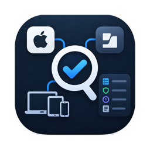
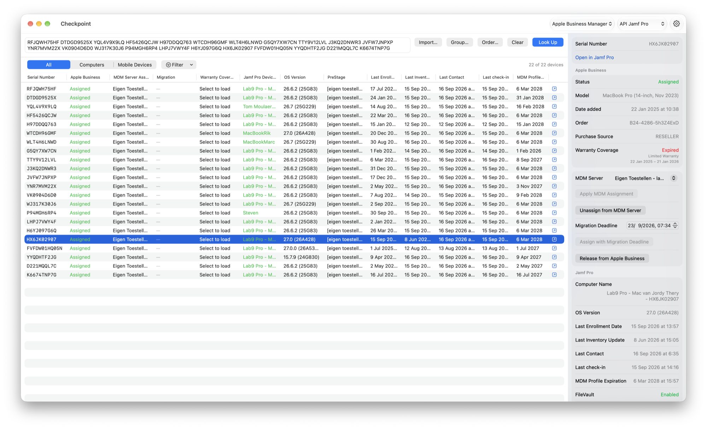

  

# Checkpoint

**One list of serial numbers. Both sides of the story.**

Checkpoint is a macOS app for Mac admins that cross-references devices between **Apple Business** and **Jamf Pro**. Instead of switching between two consoles to establish where a device actually stands, you get both perspectives side by side in a single table, and the tools to act on what you find.

Enter serial numbers, typed, pasted, imported from a text/CSV file, or taken from a Jamf Pro group or an Apple Business order, and Checkpoint reports, per device:

**From Apple Business**

- Assignment status (assigned / unassigned / released) and the assigned MDM server
- MDM server migration status and deadline
- Warranty and AppleCare coverage
- Model, order number, and purchase source

**From Jamf Pro**

- Whether a device record exists, and its name
- PreStage enrollment scope and site
- Last enrollment date, last inventory update, Last Contact, and last check-in
- MDM profile expiration
- FileVault state (Macs) and passcode state (mobile devices)
- Managed software update status, with deferrals remaining

## Beyond reporting

Checkpoint doesn't just surface discrepancies, it resolves them. Every action works on a single device or in bulk across a multi-selection, and always asks for confirmation first:

- **Apple Business**: assign or unassign the MDM server, schedule a migration to another MDM server with a deadline (then update or cancel it), release a device from the organization
- **Jamf Pro**: change PreStage scope (computers and mobile devices), change the site, delete the device record
- **MDM commands**, computers: Lock, Renew MDM Profile, Redeploy Jamf Framework, Wipe, Send Blank Push, Remove MDM Profile; mobile devices: Update Inventory, Lock, Clear Passcode, Restart, Shut Down, Wipe, Remove MDM Profile, Send Blank Push, Renew MDM Profile
- Every device links directly to its record in Jamf Pro

Multiple Apple Business organizations and multiple Jamf Pro servers (e.g. production and testing) can be configured and switched from the toolbar. Everything Checkpoint sends is recorded in an [activity log](#activity-log).

### Looking up a group or an order

**Group…** lists every computer and mobile device group on the selected Jamf Pro server, smart and static alike, and loads the members of the one you pick.

**Order…** lists the Apple Business order numbers in your organization with the number of devices on each. Apple cannot search devices by order number, so Checkpoint reads the device list once and reuses it; the first use takes about a minute and later ones are immediate.

Both fill the serial field, and both ask for confirmation above 25 devices, since neither a group name nor an order number reveals that it covers several hundred.

Above 15 devices, Apple Business is read in bulk instead of one device at a time. Apple allows an organization only about twenty requests a minute and offers no way to filter the device list, so asking per device does not scale: a few hundred devices would otherwise take the best part of an hour. Reading the whole organization costs one request per thousand devices plus one per MDM server — about twenty for a typical organization — and a 389-device group completes in a little over a minute.

The one thing not available in bulk is **AppleCare coverage**, which Apple serves only per device. In a bulk lookup that column reads "Select to load" and fills in when you select the device.

### MDM server migration

Assigning a device to a different MDM server normally takes effect on the next wipe or enrollment. Apple Business can instead schedule a *migration*: the device keeps running under its current service until it moves, nothing is erased, and Apple prompts the user and enforces the deadline on-device. Checkpoint shows the migration status and deadline for each device, and can schedule, reschedule or cancel one, individually or in bulk. Deadlines cannot be more than 90 days out, and shortening a deadline (or setting one in the past) applies immediately without giving the user a chance to delay.

Migration requires an Apple Business tenant on a release that supports it. Devices Apple reports as not migration-capable are skipped, and the option only appears when a device is eligible.

### Recovery secrets

For Macs, Checkpoint can show the **FileVault personal recovery key**, the **Recovery Lock password**, the **device lock PIN**, and the password for each **managed local administrator account**. Unlike the actions above these are single-device only, are not part of a lookup, and are fetched only when you ask for one. The value appears in a sheet for as long as it is open and is never written to the table, kept on the device record, or included in an export.

Managed local administrator accounts are listed as Jamf Pro lists them, one row per account with its source, so a Mac carrying both a PreStage account and one created by the Jamf binary shows both under their own usernames. Viewing a password causes Jamf Pro to rotate it after the instance's rotation time, so Checkpoint asks for confirmation first and records the view as a change.

### Activity log

Window → Activity Log (⌥⌘L) shows what Checkpoint asked the two services to do and how they answered, in two tiers: the action you requested, and each HTTP request made to carry it out. It is searchable by serial number, so you can follow one device through a bulk operation, and it records reads of recovery secrets as well as changes.

The log is held in memory only and is discarded when Checkpoint quits. Nothing is written to disk, and no secret reaches it: request headers are never recorded, sign-ins are logged without either body, and the endpoints carrying a recovery key, password, PIN or unlock token withhold their bodies entirely.

Copy and export each come in a masked form, replacing serial numbers, UDIDs and hardware addresses with `<device 1>`, `<device 2>` and so on — consistently, so a device stays recognisable without being named. Use it when attaching a log to a bug report.

## Requirements

- macOS 15 or later
- An Apple Business API account per organization, with the **Device Enrollment Manager** role or higher
- A Jamf Pro server, connected by **API client** (recommended), **username and password**, or the **Platform API** gateway
- Jamf Pro 11.30+ for the Last Contact attribute (older versions simply show "—")

## Setting it up

- **[Permissions](docs/permissions.md)** — the Apple Business role, and the Jamf Pro privileges each feature and command needs
- **[Platform API](docs/platform-api.md)** — optional: connecting through Jamf's gateway, the capabilities it takes, and the three commands it cannot carry

## Security

Credentials are stored only on your Mac: secrets (Apple Business private key, Jamf client secrets/passwords) in the keychain, non-secret configuration in user defaults. The app is sandboxed, so both live in its own container and are not readable by other apps, and it talks exclusively to your configured Jamf Pro servers and Apple's API endpoints.

Recovery keys, Recovery Lock passwords, device lock PINs and local administrator passwords are never stored. They are requested from Jamf Pro one device at a time, held only while the sheet showing them is open, and discarded when it closes.

The activity log is kept in memory only, never written to disk, and never records a secret. See [Activity log](#activity-log) for what it holds and what it withholds.

## Building

Open the project in Xcode 26 or later and build the `Checkpoint` scheme (⌘R). No dependencies, the app uses only Apple frameworks.

## Acknowledgements

Inspired by [asbmutil](https://github.com/rodchristiansen/asbmutil), [AxMJamfSync](https://github.com/karthikeyan-mac/AxMJamfSync), amongst many others.

## Support

If Checkpoint saves you time, you can [buy me a coffee](https://buymeacoffee.com/jordythery). ☕️

## License

[MIT](LICENSE)
