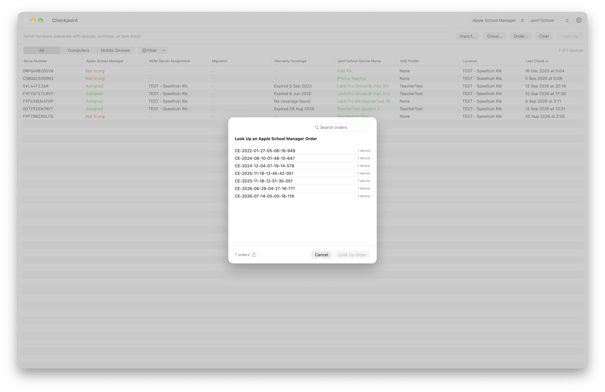
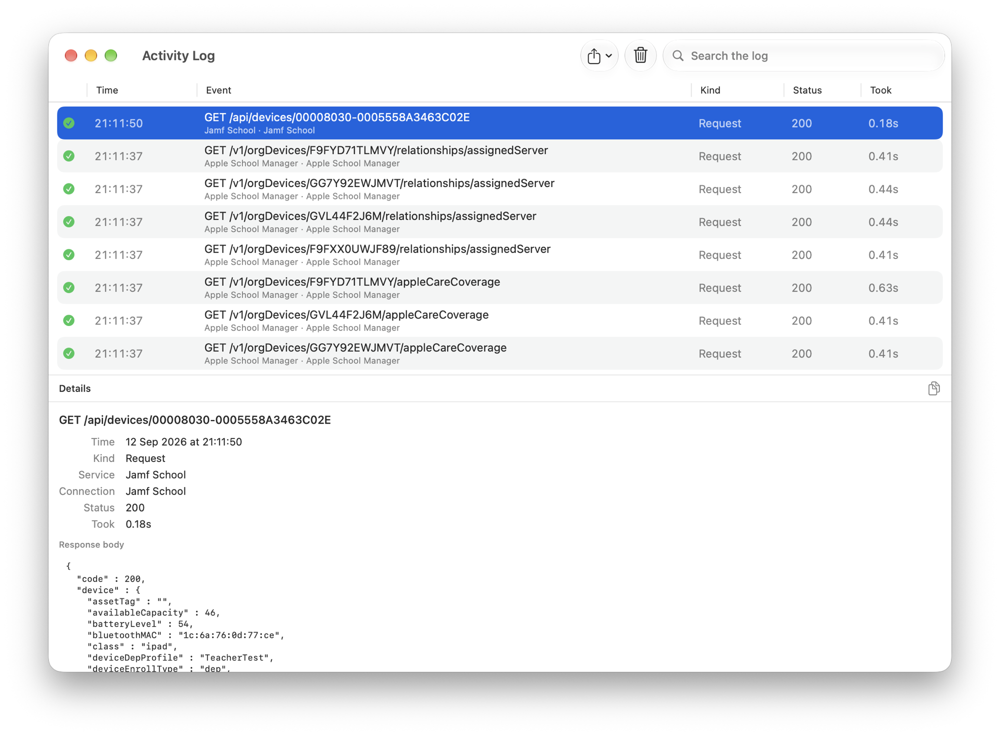

# Features

What Checkpoint does beyond reporting, and how each part behaves. For what to grant each service, see [Permissions](permissions.md), and for an Intune tenant, [Intune](intune.md).

> This page describes the release it ships with. Opening it from a tag shows that version.

## Actions

Every action works on a single device or in bulk across a multi-selection, and always asks for confirmation first.

| Service | Actions |
| --- | --- |
| Apple Business, Apple School Manager | Assign or unassign the MDM server. Schedule a migration to another MDM server with a deadline, then update or cancel it. Release a device from the organization — Apple Business only, as Apple School Manager defines no release activity |
| Jamf Pro | Change PreStage scope, for computers and mobile devices. Change the site. Delete the device record |
| Jamf School | Change the location. Move the record to the trash, from where Jamf School can restore it |
| Intune | Delete the device record, which leaves the device enrolled. See [Intune](intune.md) for why retiring it is a command rather than an action |

Multiple organizations, of either Apple service, and multiple Jamf servers, of either product, can be configured together and switched from the toolbar. Everything Checkpoint sends is recorded in the [activity log](#activity-log).

Double-clicking a row, or the arrow at the end of it, opens the device's record in the product's web interface. An Intune device opens in the Intune console. A Jamf Pro server reached through the [Platform API](platform-api.md) still links to its own URL, since the gateway host serves no web interface.

## MDM commands

**Jamf Pro** — computers: Lock, Renew MDM Profile, Redeploy Jamf Framework, Wipe, Send Blank Push, Remove MDM Profile. Mobile devices: Update Inventory, Lock, Clear Passcode, Restart, Shut Down, Wipe, Remove MDM Profile, Send Blank Push, Renew MDM Profile.

**Jamf School** — Update Inventory, Restart, Wipe, Remove MDM Profile. Jamf School draws no distinction between computers and mobile devices, so all four reach Macs as well as iPads. Its API defines no lock, shut down or lost mode, and serves clearing a passcode only through a teacher session rather than an administrative one.

**Intune** — computers: Update Inventory, Restart, Shut Down, Wipe, Remove MDM Profile. Mobile devices: the same, plus Lock and Clear Passcode. Intune keeps one collection for every platform, so the split is inferred from the platform rather than reported. Remove MDM Profile sends Intune's retire, which also removes the record — the one place where the same command means something different from the Jamf products, and the confirmation says so.

## Looking up a group or an order

**Group…** lists every computer and mobile device group on the selected Jamf Pro server, smart and static alike, and loads the members of the one you pick. Jamf School keeps one list rather than splitting by device kind, so it lists every device group with its size.

**Order…** lists the Apple order numbers in your organization with the number of devices on each. Apple cannot search devices by order number, so Checkpoint reads the device list once and reuses it; the first use takes about a minute and later ones are immediate.

Both fill the serial field, and both confirm before starting when the list is large or when the Apple organization has to be read first — neither a group name nor an order number reveals that it covers several hundred devices, or that it will take a minute.

## Several Apple organizations at once

The organization popup offers **All Organizations** when more than one is configured. A lookup then searches every one of them and the table gains an Organization column naming the one each device was found in — which answers a question a single-organization lookup cannot: *which of our Apple tenants owns this device?*

A device belongs to one organization at a time, so there is no ambiguity to resolve. The one exception is a device released from one organization and re-added to another, which both report: Checkpoint prefers the organization where it is not released. An organization that cannot be read does not hide a device another one holds — a failure is only reported for devices no organization found, and it says which organization could not be read rather than reporting those devices as missing.

**Apple actions work in one organization at a time.** Every one of them names a device management service, and a service ID means nothing outside the organization that issued it. A single device always resolves to one organization, so the inspector keeps working as usual; a bulk selection spanning two organizations disables the Apple actions and says which organizations are involved. The Jamf and Intune side is unaffected — it has one connection either way.

Searching several organizations does not mean reading them. Below the bulk threshold Checkpoint asks each organization about each device, which is cheaper than it sounds: an organization that does not hold the device says so in one request and costs nothing more, so a serial costs one request per organization plus two for whichever one has it. A handful of serials across two organizations is a second's work.

Above the threshold each organization is read in full instead, as a single-organization lookup does. Apple's quota is per organization, so those reads run at the same time and the wait is the slowest organization rather than the sum. Snapshots are then cached per organization for the session, and a lookup about to spend that minute asks first.

An Apple action afterwards re-reads only the organization it changed. The others have not changed, and re-reading one costs a minute of its quota for nothing.

## Reading in bulk

Above 15 devices the Apple organization is read in bulk instead of one device at a time. Apple allows an organization only about twenty requests a minute and offers no way to filter the device list, so asking per device does not scale: a few hundred devices would otherwise take the best part of an hour. Reading the whole organization costs one request per thousand devices plus one per MDM server — about twenty for a typical organization — and a 389-device group completes in a little over a minute.

**AppleCare coverage** is the one thing not available in bulk, because Apple serves it only per device. In a bulk lookup that column reads "Select to load" and fills in when you select the device. **Passcode state on Jamf School** works the same way, for the same reason: it appears only in that product's per-device record, not in its device list.

Jamf School has no request quota and no pagination, and serves the whole instance in one request, so a lookup of any size costs one request there whatever its size.

**Intune is read the same way**, for a different reason: Microsoft Graph documents which properties `$filter` accepts and the serial number is not among them, so there is no per-serial query to make. The tenant is read once per lookup, a thousand devices per page, and matched locally. Graph throttles per application, and a throttled request is retried once its `Retry-After` has passed.

## Filtering the results

**Filter** narrows the list to devices matching every chosen criterion: Apple organization status, which Apple organization a device is in when several were searched, MDM server, PreStage or ADE profile, site or location, installed OS version, how long ago the device last enrolled, reported inventory or made contact, and conditions worth singling out — an expired MDM profile, a migration in progress, FileVault off, no passcode, or a device present in one system and not the other. Combined with Select All, this is how a bulk action is aimed: filter to the devices with an expired profile, select them, renew.

The menu offers only what the devices in front of you actually use, with a count beside each: a list of Macs shows the four PreStages they are in rather than every PreStage on the server, and the OS versions offered are the ones the devices are running. Criteria that cannot apply to the list are left out — a Jamf School lookup offers a check-in filter but no enrollment or inventory one, having no source for either.

The date filters are presets rather than a range, and they overlap: "Less than 7 days ago" includes what reported today. "Never" means the device has a record with nothing in that field, which for last inventory usually means it has not reported since enrollment.

Filtering only reads what the lookup already fetched, so it costs nothing. Warranty coverage and software update state are deliberately not filterable, and passcode state is not filterable on Jamf School: none is present for every row, so filtering on them would quietly exclude devices whose value had simply not been fetched.

Hiding a device also deselects it, so an action can never reach a device you can no longer see.

**Sort** by clicking a column header, and reverse it by clicking again. Rows stay in the order the serials were entered until you do. Columns sort by the text they show, so statuses group as they read and version numbers order numerically; the date columns sort by the date itself, treating a device that has never reported one as the least recently seen. Sorting is display only — it changes neither the filter nor the selection.

## Activation Lock

Reported from **Apple Business or Apple School Manager**, not from the MDM, and shown for whichever device is selected. Apple added this to both services in September 2026.

The row reads **Enabled**, **Disabled** or **Unknown**, and when it is enabled it says *which kind* of lock is in place — an **MDM** lock, for which a bypass code is escrowed so that clearing it does not need the owner, or a **user** lock, which does. That is the part that decides what to do next.

The organization is the right source for three reasons: it knows the live state rather than what an inventory last collected, it covers Macs as well as iPhones and iPads, and it is the only one that distinguishes the two kinds of lock. Jamf Pro does report a lock boolean for mobile devices in its inventory, and Checkpoint deliberately does not show it: two rows that could disagree are worse than one that is authoritative.

Apple serves this one device at a time, so it is read on selection like warranty coverage rather than in a lookup. A device whose lock state Apple will not report reads as Unknown rather than as disabled — Apple fails that read for a device reporting an internal-only lock state, and "Disabled" would be the wrong conclusion from a failure.

Checkpoint reports the state and nothing more: it never reads or stores a bypass code — those are escrowed with Apple and the MDM — and it offers no way to clear a lock, which neither Apple service exposes in any case.

## MDM server migration

Assigning a device to a different MDM server normally takes effect on the next wipe or enrollment. Apple can instead schedule a *migration*: the device keeps running under its current service until it moves, nothing is erased, and Apple prompts the user and enforces the deadline on-device. Checkpoint shows the migration status and deadline for each device, and can schedule, reschedule or cancel one, individually or in bulk.

Deadlines cannot be more than 90 days out, and shortening a deadline, or setting one in the past, applies immediately without giving the user a chance to delay. Devices Apple reports as not migration-capable are skipped, and the option only appears when a device is eligible.

## Software updates and declarations

Jamf Pro only. Neither Jamf School nor Intune reports any of this: Intune serves update state only through a tenant-wide report export, not per device.

**Software update state** comes from the device's own declarative status report. `install-state` is what says whether anything is pending: `none` means nothing is, and that the last update succeeded. The version, deadline and failure beside it are kept by the report long after they stop being true — a Mac that updated months ago still carries the version it was offered — so they appear only while an update is outstanding, and a remembered failure is shown as history with its date. Beta enrolment is exempt, since Apple requires that key on every report, so it is stated either way.

**Declaration status** is read from the platform's own declaration reporting when the connection is a [Platform API](platform-api.md) one, and otherwise parsed out of the status report, where Jamf Pro flattens it into one unquoted string. Same rows either way; the platform serves it as typed JSON, so it is preferred where it is available.

Declaration status is the device's verdict rather than the server's intent, and the two can disagree entirely: Jamf Pro reports a blueprint as deployed once it has handed the declaration over, while the device decides whether it can be applied. A rejected software update declaration means nothing is enforcing updates, however healthy the blueprint looks, and the device's reason is shown as written because it names the version at fault. Declarations are counted by outcome — active, invalid, and held but not applied — since a device can carry two dozen with one in effect.

**The enforced target** is read back from the declaration, which the status report identifies without saying what it contains, then compared against the installed OS. An enforcement the device has already met reads as satisfied rather than as a missed deadline; one still owed keeps its deadline and names what is installed instead. A target in another major release is marked as an upgrade.

Two limits. Jamf Pro will not serve a declaration whose identifier comes from a blueprint, so the target cannot be read when a blueprint is what enforces the update — the deadline still appears under Software Update, and a rejected declaration is still reported, both coming from the status report. And blueprints have no endpoint on a Jamf Pro instance, so only a [Platform API](platform-api.md) connection can name one; a direct connection shows its identifier.

## Device compliance

Reported for Jamf Pro and Intune, which reach it differently.

**Intune** evaluates compliance itself and reports it with every device, so it arrives with the lookup.

**Jamf Pro** does not evaluate compliance — it relays a verdict from the vendor its Device Compliance integration points at, one device at a time. Both a direct connection and a [Platform API](platform-api.md) one can read it. Checkpoint therefore reads it when a device is selected, and names the vendor alongside the verdict, because that is who to ask when the verdict is not what you expect. It checks once per server whether the integration is switched on at all, so a fleet without it never pays a request per device. A device outside the integration's scope reports nothing rather than reporting as non-compliant.

Neither is filterable. Jamf Pro's is not present until a device is selected, for the same reason warranty coverage is not filterable, and a filter that worked on one product and not the other would be worse than none.

## Recovery secrets

Jamf Pro only. Intune holds a FileVault recovery key, but only its beta endpoint serves one, so it is left out until that is not the case. For Macs, Checkpoint can show the **FileVault personal recovery key**, the **Recovery Lock password**, the **device lock PIN**, and the password for each **managed local administrator account**. Unlike the actions above these are single-device only, are not part of a lookup, and are fetched only when you ask for one. The value appears in a sheet for as long as it is open and is never written to the table, kept on the device record, or included in an export.

Managed local administrator accounts are listed as Jamf Pro lists them, one row per account with its source, so a Mac carrying both a PreStage account and one created by the Jamf binary shows both under their own usernames. Viewing a password causes Jamf Pro to rotate it after the instance's rotation time, so Checkpoint asks for confirmation first and records the view as a change.

## Updates

Checkpoint checks GitHub once a day for a newer release, and Checkpoint → Check for Updates… asks on demand. When one exists, a sheet shows its release notes; Download fetches the zip and saves it where you choose, and installing remains replacing the app in Applications — the sandbox does not permit an app to replace itself. The check is one request to GitHub's release API, sends nothing but the request itself, and can be turned off in Settings → General.

## Activity log

Window → Activity Log (⌥⌘L) shows what Checkpoint asked each service to do and how it answered, in two tiers: the action you requested, and each HTTP request made to carry it out. It is searchable by serial number, so you can follow one device through a bulk operation, and it records reads of recovery secrets as well as changes.

Every service is logged the same way, including Microsoft Graph. The log is held in memory only and is discarded when Checkpoint quits. Nothing is written to disk, and no secret reaches it: request headers are never recorded, sign-ins are logged without either body, and the endpoints carrying a recovery key, password, PIN or unlock token withhold their bodies entirely. Jamf School attaches an owner to every device record, so the owner and any notes are withheld too — in a school those are pupils.

Copy and export each come in a masked form, replacing serial numbers, UDIDs and hardware addresses with `<device 1>`, `<device 2>` and so on — consistently, so a device stays recognisable without being named. Use it when attaching a log to a bug report.
